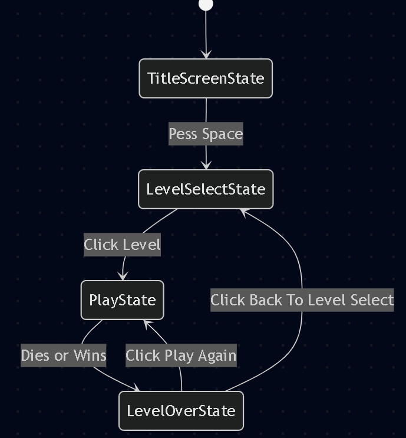
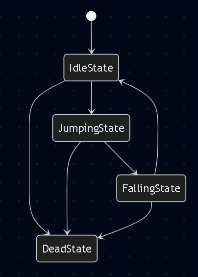
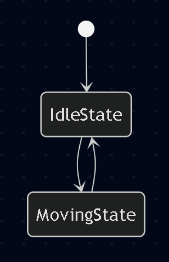
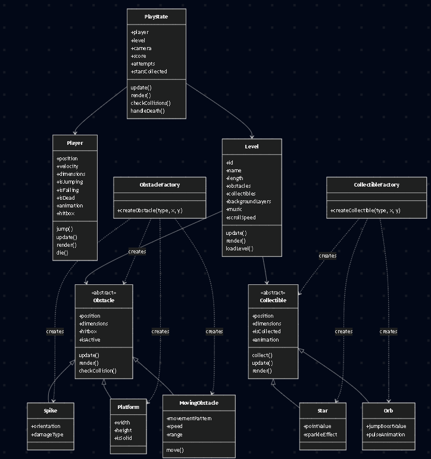
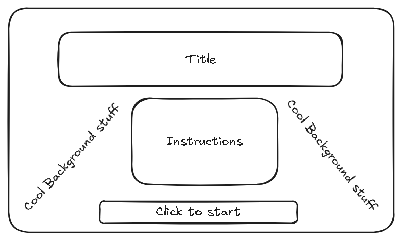
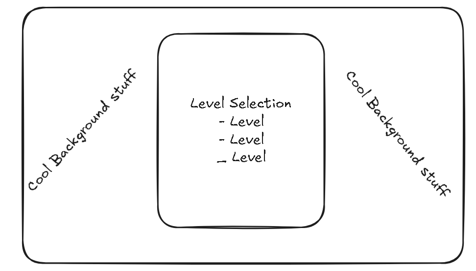
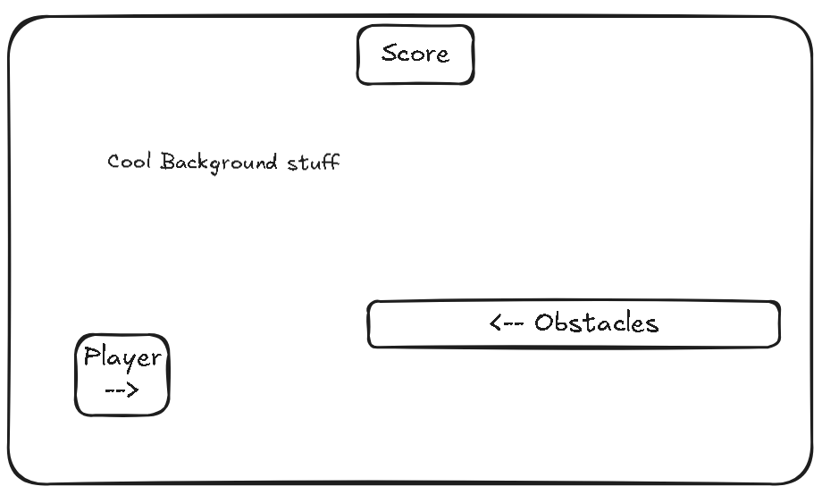
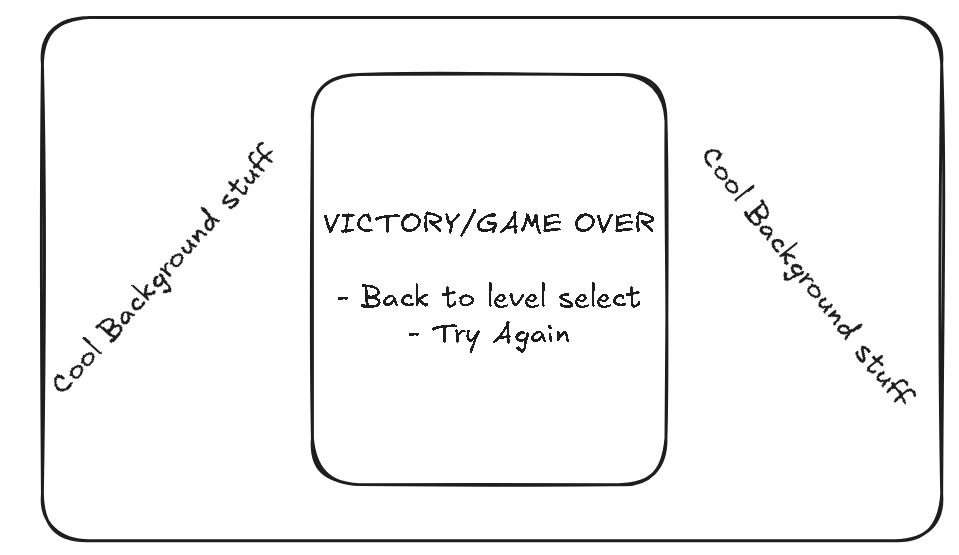

# Final Project - Geometry Dash(Codester version)

- [x] Read the [project requirements](https://vikramsinghmtl.github.io/420-5P6-Game-Programming/project/requirements).
- [x] Replace the sample proposal below with the one for your game idea.
- [ ] Get the proposal greenlit by Vik.
- [ ] Place any assets in `assets/` and remember to update `src/config.json`.
- [ ] Decide on a height and width inside `src/globals.js`. The height and width will most likely be determined based on the size of the assets you find.
- [ ] Start building the individual components of your game, constantly referring to the proposal you wrote to keep yourself on track.
- [ ] Good luck, you got this!

---

## ✒️ Description

**Premise:** A platformer where players control a object(cube shaped) navigating through obstacle-filled levels. The goal is to reach the end portal without colliding with any obstacles. One hit means instant death and restart from the beginning.

**Genre:** Platformer

**Control Scheme:**

- SPACEBAR or MOUSE CLICK: Jump
- ARROW KEYS and ENTER: Navigate menus

## 🕹️ Gameplay

The player's character automatically moves forward where the player must time their jumps to avoid spikes, pits, moving obstacles and other enemies. Collecting stars along the way earns bonus points. Players can select from multiple levels, each with increasing difficulty. Upon death, players are asked if they would like to try again or go back to main menu.

## 📃 Requirements

1. The player shall jump using spacebar or mouse click.
2. The player shall automatically move forward / the objects move towards them.
3. The player shall die instantly upon collision with any obstacle.
4. The player shall be prompted to restart or go back to the main menu upon death or level completion.
5. The player shall collect stars scattered throughout levels for bonus points.
6. The player shall complete a level by reaching the end point.
7. The player shall select from multiple levels (minimum 2) from a level select screen.
8. The player shall navigate menus using arrow keys and enter.
9. The player shall view instructions explaining controls and gameplay.
10. The system shall display smooth animations for jumping, death, and obstacles.
11. The system shall play background sounds for each level.
12. The system shall display particle effects on death and star collection.
13. The system shall transition between states using smooth tweens.
14. The system shall display the player's score at the top of the screen.

### 🤖 State Diagram

### 🗺️ Class Diagram

### 🧵 Wireframes

- _Click to start_ will navigate to the level selection screen.

### 🎨 Assets

I used [excalidraw](https://excalidraw.com/) to create the wireframes. Wireframes are the equivalent to the skeleton of a web app since they are used to describe the functionality of the product and the users experience.

#### 🖼️ Images

- All the sprites for the character, obstacles, enemies and more will be taken from --> [Sprite Sheet](./assets/images/SpriteSheet.png).

#### ✏️ Fonts

For fonts, I want some clean but flashy fonts to reflect my platformer style. Press Start 2P and VT323 from google fonts perfectly reflect that pixel art style yet still being perfectly legible.

- [Title/Header](https://fonts.google.com/specimen/Press+Start+2P?query=Press+Start+2P)
- [UIText](https://fonts.google.com/specimen/VT323?query=VT323)

#### 🔊 Sounds

All sounds were taken from [freesound.org](https://freesound.org).

- [Jump](https://freesound.org/people/suntemple/sounds/253178/)
- [Death](https://freesound.org/people/likeclockwork/sounds/168408/)
- [Collect](https://freesound.org/people/Xiko__/sounds/711129/)
- [Victory](https://freesound.org/people/1bob/sounds/717771/)
- [Menu Navigation](https://freesound.org/people/gobbe57/sounds/794487/)
- [Menu Select](https://freesound.org/people/pumodi/sounds/150222/)
